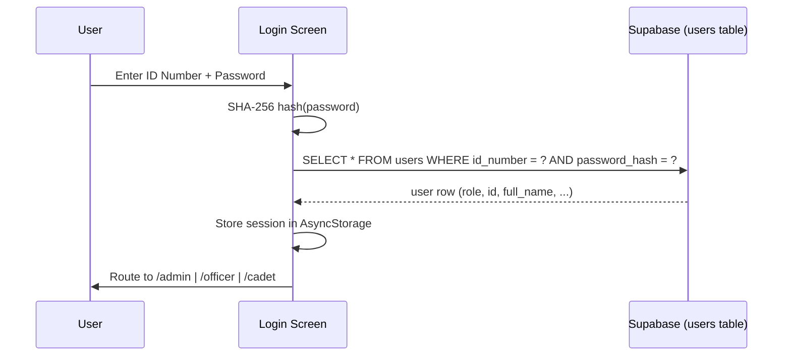
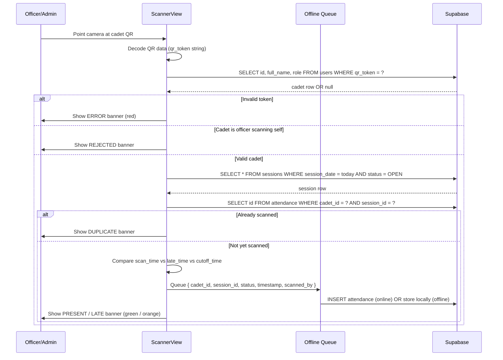
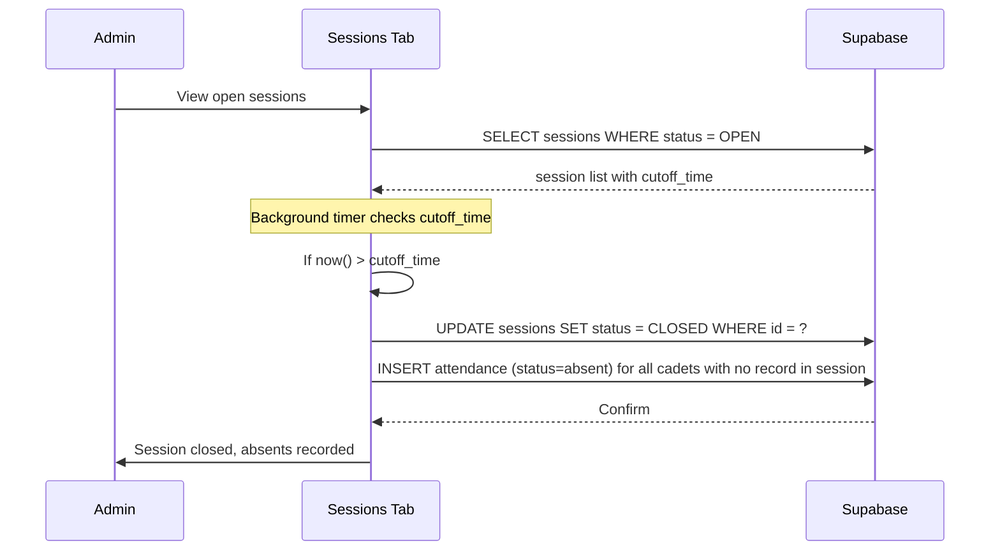

# Design Document: ROTC Attendance System

## MSU – Zamboanga Sibugay ROTC Unit

---

## Overview

A production-ready, mobile-first ROTC Attendance System built on Expo Router (React Native) with a Supabase backend. The system supports three roles — Admin (S1 Personnel Officer), Officer (Platoon Leader), and Cadet — each with distinct permissions. Core capabilities include QR-based attendance scanning with AM/PM session logic, bulk Excel cadet import, digital ROTC ID cards with unique QR tokens, offline scan queuing with auto-sync, and attendance reporting with Excel export.

The existing codebase has a working shell (login screen, role dashboards, ImportView with Excel parsing, ScannerView with mock logic, digital-id screen with hardcoded data) connected to a live Supabase project (`mppgpfpjwzzezppuvtnv.supabase.co`). This design covers all gaps: real Supabase auth, complete session management, real QR validation, offline sync, cadet management CRUD, reports, announcements, and a live digital ID portal.

---

## Architecture

```mermaid
graph TD
    subgraph Client ["Mobile App (Expo Router / React Native)"]
        Login["Login Screen\n(index.tsx)"]
        Admin["Admin Dashboard\n(admin.tsx)"]
        Officer["Officer Dashboard\n(officer.tsx)"]
        Cadet["Cadet Dashboard\n(cadet.tsx)"]
        DigitalID["Digital ID Portal\n(digital-id.tsx)"]

        subgraph AdminTabs["Admin Tabs"]
            AHome["Home / Stats"]
            ACadets["Cadets CRUD"]
            ASessions["Sessions Mgmt"]
            AScanner["QR Scanner"]
            AImport["Excel Import"]
            AReports["Reports / Export"]
        end

        subgraph OfficerTabs["Officer Tabs"]
            OScanner["QR Scanner"]
            OResults["Attendance Results"]
        end

        subgraph CadetViews["Cadet Views"]
            CHome["Dashboard (Today + History)"]
            CID["Digital ID Card"]
            CAnnouncements["Announcements"]
        end
    end

    subgraph OfflineLayer["Offline Layer"]
        AsyncQ["AsyncStorage\nScan Queue"]
        SyncMgr["Sync Manager\n(NetInfo listener)"]
    end

    subgraph Supabase["Supabase (Cloud)"]
        Auth["Custom Auth\n(users table + SHA-256)"]
        DB["PostgreSQL\n(users, sessions, attendance,\nannouncements, digital_ids)"]
        Storage["Supabase Storage\n(profile photos)"]
        RLS["Row Level Security\nPolicies"]
    end

    Login -->|authenticate| Auth
    Auth -->|role-based route| Admin
    Auth -->|role-based route| Officer
    Auth -->|role-based route| Cadet

    AScanner -->|scan QR token| AsyncQ
    OScanner -->|scan QR token| AsyncQ
    AsyncQ -->|online| SyncMgr
    SyncMgr -->|upsert attendance| DB

    AImport -->|parse xlsx + upsert| DB
    ACadets -->|CRUD| DB
    ASessions -->|create/close| DB
    AReports -->|query + export xlsx| DB

    CHome -->|read own attendance| DB
    CID -->|read qr_token| DB
    CID -->|upload photo| Storage

    DigitalID -->|public search| DB
```



---

## Sequence Diagrams

### Login Flow



### QR Attendance Scan Flow



### Session Auto-Close Flow



---

## Database Schema (Updated)

### users table (extended)

```sql
CREATE TABLE public.users (
    id            UUID PRIMARY KEY DEFAULT uuid_generate_v4(),
    id_number     TEXT UNIQUE NOT NULL,
    full_name     TEXT NOT NULL,
    gender        TEXT CHECK (gender IN ('Male', 'Female', 'Other')),
    role          TEXT NOT NULL CHECK (role IN ('admin', 'officer', 'cadet')),
    platoon       TEXT,
    year_level    TEXT,
    qr_token      TEXT UNIQUE,
    password_hash TEXT,
    photo_url     TEXT,
    is_active     BOOLEAN DEFAULT TRUE,
    created_at    TIMESTAMPTZ DEFAULT NOW(),
    updated_at    TIMESTAMPTZ DEFAULT NOW()
);
```

### sessions table (extended)

```sql
CREATE TABLE public.sessions (
    id            UUID PRIMARY KEY DEFAULT uuid_generate_v4(),
    session_date  DATE NOT NULL DEFAULT CURRENT_DATE,
    session_type  TEXT NOT NULL CHECK (session_type IN ('AM', 'PM')),
    start_time    TIME NOT NULL,
    late_time     TIME NOT NULL,
    cutoff_time   TIME NOT NULL,
    status        TEXT NOT NULL DEFAULT 'OPEN' CHECK (status IN ('OPEN', 'CLOSED')),
    created_by    UUID REFERENCES public.users(id),
    created_at    TIMESTAMPTZ DEFAULT NOW(),
    UNIQUE(session_date, session_type)
);
```

### attendance table (extended)

```sql
CREATE TABLE public.attendance (
    id          UUID PRIMARY KEY DEFAULT uuid_generate_v4(),
    cadet_id    UUID NOT NULL REFERENCES public.users(id) ON DELETE CASCADE,
    session_id  UUID NOT NULL REFERENCES public.sessions(id) ON DELETE CASCADE,
    status      TEXT NOT NULL CHECK (status IN ('present', 'late', 'absent', 'excused')),
    scan_time   TIMESTAMPTZ DEFAULT NOW(),
    scanned_by  UUID REFERENCES public.users(id),
    notes       TEXT,
    UNIQUE(cadet_id, session_id)
);
```

### announcements table (new)

```sql
CREATE TABLE public.announcements (
    id         UUID PRIMARY KEY DEFAULT uuid_generate_v4(),
    title      TEXT NOT NULL,
    body       TEXT NOT NULL,
    created_by UUID REFERENCES public.users(id),
    created_at TIMESTAMPTZ DEFAULT NOW()
);
```

### offline_queue table (local AsyncStorage only — not Supabase)

```typescript
interface OfflineScanRecord {
  localId: string; // uuid generated locally
  cadet_id: string;
  session_id: string;
  status: "present" | "late";
  scan_time: string; // ISO string
  scanned_by: string;
  synced: boolean;
}
```

---

## Components and Interfaces

### AuthService

**Purpose**: Handles login, session persistence, and logout using the custom `users` table (not Supabase Auth).

**Interface**:

```typescript
interface AuthService {
  login(idNumber: string, password: string): Promise<AuthResult>;
  logout(): Promise<void>;
  getSession(): Promise<UserSession | null>;
  hashPassword(plain: string): Promise<string>;
}

type AuthResult =
  | { success: true; user: UserSession }
  | { success: false; error: string };

interface UserSession {
  id: string;
  id_number: string;
  full_name: string;
  role: "admin" | "officer" | "cadet";
  platoon: string | null;
  qr_token: string | null;
  photo_url: string | null;
}
```

**Responsibilities**:

- SHA-256 hash the entered password via `expo-crypto`
- Query `users` table for matching `id_number` + `password_hash`
- Persist session to AsyncStorage
- Route user to correct dashboard based on `role`

---

### SessionManager

**Purpose**: Admin creates, monitors, and closes AM/PM sessions. Handles auto-absent logic on close.

**Interface**:

```typescript
interface SessionManager {
  createSession(params: CreateSessionParams): Promise<Session>;
  closeSession(sessionId: string): Promise<void>;
  getOpenSession(date: string, type: "AM" | "PM"): Promise<Session | null>;
  autoMarkAbsents(sessionId: string): Promise<number>;
}

interface CreateSessionParams {
  session_date: string; // YYYY-MM-DD
  session_type: "AM" | "PM";
  start_time: string; // HH:MM (24h)
  late_time: string; // HH:MM (24h)
  cutoff_time: string; // HH:MM (24h)
}

interface Session {
  id: string;
  session_date: string;
  session_type: "AM" | "PM";
  start_time: string;
  late_time: string;
  cutoff_time: string;
  status: "OPEN" | "CLOSED";
}
```

**Responsibilities**:

- Enforce unique constraint (one AM, one PM per date)
- On close: INSERT absent records for all cadets with no attendance row for that session
- Display session status in real-time on Admin Home

---

### QRScanService

**Purpose**: Validates a scanned QR token, determines attendance status, and writes the record (online or offline queue).

**Interface**:

```typescript
interface QRScanService {
  processQRScan(params: ScanParams): Promise<ScanResult>;
  resolveAttendanceStatus(scanTime: Date, session: Session): AttendanceStatus;
}

interface ScanParams {
  qrToken: string;
  session: Session;
  scannedBy: string; // officer/admin user id
}

type AttendanceStatus = "present" | "late" | "blocked";

type ScanResult =
  | { outcome: "present" | "late"; cadet: CadetInfo; timestamp: string }
  | { outcome: "duplicate"; cadet: CadetInfo }
  | { outcome: "blocked"; reason: "cutoff_passed" }
  | {
      outcome: "invalid";
      reason: "bad_token" | "self_scan" | "no_open_session";
    };
```

**Responsibilities**:

- Lookup `qr_token` in `users` table
- Reject if scanner is scanning their own QR
- Check for existing attendance record (duplicate prevention)
- Compare current time against `late_time` and `cutoff_time`
- Write to Supabase if online, else push to offline queue

---

### OfflineSyncService

**Purpose**: Manages the local scan queue and syncs to Supabase when connectivity is restored.

**Interface**:

```typescript
interface OfflineSyncService {
  enqueue(record: OfflineScanRecord): Promise<void>;
  syncPending(): Promise<SyncResult>;
  getPendingCount(): Promise<number>;
  clearSynced(): Promise<void>;
}

interface SyncResult {
  synced: number;
  failed: number;
  errors: string[];
}
```

**Responsibilities**:

- Store pending scans in AsyncStorage under key `rotc_offline_queue`
- Listen to `@react-native-community/netinfo` for connectivity changes
- On reconnect: flush queue to Supabase via upsert (handles duplicates gracefully)
- Show pending count badge in scanner UI

---

### ImportService

**Purpose**: Parses Excel file, generates credentials and QR tokens, upserts to Supabase in batches.

**Interface**:

```typescript
interface ImportService {
  parseExcel(fileUri: string): Promise<ParsedCadet[]>;
  generateCredentials(row: ExcelRow): Promise<CadetCredentials>;
  batchUpsert(
    cadets: CadetCredentials[],
    batchSize?: number,
  ): Promise<ImportResult>;
}

interface ExcelRow {
  "ID Number": string;
  "Full Name": string;
  Gender?: string;
  Platoon?: string;
  "Year Level"?: string;
}

interface CadetCredentials {
  id_number: string;
  full_name: string;
  gender: string | null;
  platoon: string | null;
  year_level: string | null;
  role: "cadet";
  password_hash: string;
  qr_token: string;
}

interface ImportResult {
  total: number;
  inserted: number;
  updated: number;
  skipped: number;
  errors: string[];
}
```

**Responsibilities**:

- Auto-generate password: `UPPER(firstName[0..2]) + idNumber[-4:]`
- SHA-256 hash password via `expo-crypto`
- Generate unique QR token: SHA-256 of `idNumber + timestamp`
- Upsert in batches of 500 with `onConflict: 'id_number'`
- Add `gender` field (missing from current ImportView)

---

### DigitalIDService

**Purpose**: Fetches cadet data for ID card display, handles photo upload, and generates shareable links.

**Interface**:

```typescript
interface DigitalIDService {
  getCadetByIdOrName(query: string): Promise<CadetIDData[]>;
  uploadPhoto(cadetId: string, imageUri: string): Promise<string>;
  getShareableLink(cadetId: string): string;
}

interface CadetIDData {
  id: string;
  id_number: string;
  full_name: string;
  platoon: string | null;
  year_level: string | null;
  qr_token: string;
  photo_url: string | null;
  is_active: boolean;
}
```

**Responsibilities**:

- Public search endpoint (no auth required for `/digital-id` portal)
- Upload photo to Supabase Storage bucket `cadet-photos`
- Update `photo_url` in `users` table
- Generate shareable URL: `{appBaseUrl}/digital-id?id={cadet_id}`

---

### ReportsService

**Purpose**: Queries attendance data and exports to Excel.

**Interface**:

```typescript
interface ReportsService {
  getAttendanceReport(filters: ReportFilters): Promise<AttendanceRow[]>;
  exportToExcel(rows: AttendanceRow[]): Promise<string>;
}

interface ReportFilters {
  startDate?: string;
  endDate?: string;
  platoon?: string;
  searchQuery?: string;
}

interface AttendanceRow {
  cadet_id: string;
  id_number: string;
  full_name: string;
  platoon: string | null;
  session_date: string;
  session_type: "AM" | "PM";
  status: "present" | "late" | "absent" | "excused";
  score: number; // present=1.0, late=0.75, absent=0, excused=0
  scan_time: string | null;
}
```

---

## Data Models

### UserSession (stored in AsyncStorage)

```typescript
interface UserSession {
  id: string;
  id_number: string;
  full_name: string;
  role: "admin" | "officer" | "cadet";
  platoon: string | null;
  qr_token: string | null;
  photo_url: string | null;
}
```

**Validation Rules**:

- `role` must be one of `admin | officer | cadet`
- `id_number` is non-empty string
- Session stored under AsyncStorage key `rotc_user_session`

### AttendanceStatus Scoring

```typescript
const ATTENDANCE_SCORES: Record<string, number> = {
  present: 1.0,
  late: 0.75,
  absent: 0.0,
  excused: 0.0,
};
```

### Cadet Standing Thresholds

```typescript
interface CadetStanding {
  status: "Active" | "Warning" | "Drop";
}

// Derived from absence count:
// 0-2 absences → Active
// 3-4 absences → Warning
// 5+ absences  → Drop
```

---

## Key Functions with Formal Specifications

### `hashPassword(plain: string): Promise<string>`

**Preconditions:**

- `plain` is a non-empty string

**Postconditions:**

- Returns a 64-character lowercase hex SHA-256 digest
- Deterministic: same input always produces same output
- No side effects

**Implementation:**

```typescript
import * as Crypto from "expo-crypto";

async function hashPassword(plain: string): Promise<string> {
  return Crypto.digestStringAsync(Crypto.CryptoDigestAlgorithm.SHA256, plain);
}
```

---

### `resolveAttendanceStatus(scanTime, session): AttendanceStatus`

**Preconditions:**

- `scanTime` is a valid Date object
- `session.status === 'OPEN'`
- `session.late_time` and `session.cutoff_time` are valid HH:MM strings

**Postconditions:**

- Returns `'present'` if `scanTime < late_time`
- Returns `'late'` if `late_time <= scanTime < cutoff_time`
- Returns `'blocked'` if `scanTime >= cutoff_time`

**Loop Invariants:** N/A (no loops)

**Implementation:**

```typescript
function resolveAttendanceStatus(
  scanTime: Date,
  session: Session,
): AttendanceStatus {
  const toMinutes = (hhmm: string) => {
    const [h, m] = hhmm.split(":").map(Number);
    return h * 60 + m;
  };

  const scanMinutes = scanTime.getHours() * 60 + scanTime.getMinutes();
  const lateMinutes = toMinutes(session.late_time);
  const cutoffMinutes = toMinutes(session.cutoff_time);

  if (scanMinutes >= cutoffMinutes) return "blocked";
  if (scanMinutes >= lateMinutes) return "late";
  return "present";
}
```

---

### `autoMarkAbsents(sessionId: string): Promise<number>`

**Preconditions:**

- `sessionId` is a valid UUID referencing a CLOSED session
- All cadets with `role = 'cadet'` and `is_active = true` are the target set

**Postconditions:**

- Every active cadet without an attendance record for `sessionId` gets an `absent` record inserted
- Returns count of absent records inserted
- Idempotent: running twice does not create duplicates (UNIQUE constraint on `cadet_id, session_id`)

**Algorithm:**

```pascal
ALGORITHM autoMarkAbsents(sessionId)
INPUT: sessionId: UUID
OUTPUT: absentCount: Integer

BEGIN
  allCadets ← SELECT id FROM users WHERE role = 'cadet' AND is_active = true
  scannedIds ← SELECT cadet_id FROM attendance WHERE session_id = sessionId

  absentCadets ← allCadets MINUS scannedIds
  absentCount ← 0

  FOR each cadetId IN absentCadets DO
    INSERT INTO attendance (cadet_id, session_id, status)
    VALUES (cadetId, sessionId, 'absent')
    ON CONFLICT DO NOTHING
    absentCount ← absentCount + 1
  END FOR

  RETURN absentCount
END
```

---

### `syncOfflineQueue(): Promise<SyncResult>`

**Preconditions:**

- Device has network connectivity
- AsyncStorage key `rotc_offline_queue` contains array of `OfflineScanRecord`

**Postconditions:**

- All unsynced records are upserted to Supabase `attendance` table
- Synced records are marked `synced: true` in local storage
- Returns count of synced and failed records

**Algorithm:**

```pascal
ALGORITHM syncOfflineQueue()
INPUT: none (reads from AsyncStorage)
OUTPUT: SyncResult

BEGIN
  queue ← AsyncStorage.getItem('rotc_offline_queue')
  pending ← FILTER queue WHERE synced = false
  synced ← 0
  failed ← 0
  errors ← []

  FOR each record IN pending DO
    result ← supabase.attendance.upsert(record, onConflict: 'cadet_id,session_id')

    IF result.error = null THEN
      record.synced ← true
      synced ← synced + 1
    ELSE
      failed ← failed + 1
      errors.append(result.error.message)
    END IF
  END FOR

  AsyncStorage.setItem('rotc_offline_queue', queue)
  RETURN { synced, failed, errors }
END
```

---

## Screen-by-Screen Implementation Plan

### `app/index.tsx` — Login Screen

- Replace mock `handleLogin` with real `AuthService.login()`
- Hash password before querying
- Store `UserSession` in AsyncStorage on success
- Route based on `user.role`

### `app/admin.tsx` — Admin Dashboard

- **Home tab**: Pull live stats from Supabase (total cadets, today present, at-risk count)
- **Cadets tab**: FlatList of all cadets, search by name/ID, tap to edit, swipe to delete
- **Sessions tab**: Create AM/PM session form (date, start_time, late_time, cutoff_time), list open/closed sessions, close button
- **Scanner tab**: Real `ScannerView` with `QRScanService`
- **Import tab**: Existing `ImportView` + add gender field
- **Reports tab**: Date-range filter, FlatList of results, Export to Excel button

### `app/officer.tsx` — Officer Dashboard

- **Scanner tab**: Same `ScannerView` as admin (officer cannot close sessions)
- **Results tab**: Read-only attendance list for their platoon for today's sessions

### `app/cadet.tsx` — Cadet Dashboard

- Load real data from Supabase using stored `UserSession.id`
- Today's AM/PM status from `attendance` table
- History: count of present/late/absent, derive standing
- Announcements section from `announcements` table
- Edit own info (limited: photo, contact info)

### `app/digital-id.tsx` — Digital ID

- Load cadet data from Supabase using `UserSession` (when accessed from cadet app)
- Public portal mode: search by name or ID number (no auth)
- Render real QR code using `react-native-qrcode-svg` (to be added as dependency)
- Photo upload via `expo-image-picker` → Supabase Storage
- Download/share via `expo-sharing` + `expo-file-system` (capture view as image)

---

## Error Handling

### Auth Errors

- **Condition**: Wrong ID/password
- **Response**: Alert "Invalid credentials. Please try again."
- **Recovery**: User re-enters credentials

### Scan Errors

- **Duplicate scan**: Show orange banner "Already recorded for this session"
- **Invalid QR**: Show red banner "Invalid QR Code"
- **No open session**: Show red banner "No active session. Contact your officer."
- **Cutoff passed**: Show red banner "Session closed. Cannot record attendance."
- **Self-scan**: Show red banner "You cannot scan your own QR code."

### Offline Errors

- **No connectivity on scan**: Queue locally, show yellow badge "Saved offline – will sync"
- **Sync failure**: Retry on next connectivity event, log error

### Import Errors

- **Missing required fields**: Skip row, report in ImportResult.errors
- **Supabase upsert failure**: Show error alert with message

---

## Testing Strategy

### Unit Testing Approach

- Test `resolveAttendanceStatus()` with boundary values (exactly at late_time, exactly at cutoff_time)
- Test `hashPassword()` for determinism and correct output length
- Test `autoMarkAbsents()` logic with mock cadet/attendance sets
- Test `generateCredentials()` for correct password format and QR token uniqueness

### Property-Based Testing Approach

**Property Test Library**: fast-check

**Properties to test**:

- For any valid `scanTime` before `late_time`, `resolveAttendanceStatus` always returns `'present'`
- For any valid `scanTime` between `late_time` and `cutoff_time`, result is always `'late'`
- For any valid `scanTime` at or after `cutoff_time`, result is always `'blocked'`
- `hashPassword` is deterministic: `hash(x) === hash(x)` for all strings `x`
- `generateCredentials` always produces a `password_hash` of length 64 (SHA-256 hex)
- `autoMarkAbsents` is idempotent: running twice produces same absent count

### Integration Testing Approach

- Test full login flow against Supabase test project
- Test QR scan → attendance insert → duplicate rejection cycle
- Test offline queue → sync cycle with mocked network state

---

## Performance Considerations

- FlatList with `keyExtractor` and `getItemLayout` for cadet roster (100+ rows)
- Batch Excel import in chunks of 500 to avoid Supabase request size limits
- Debounce search inputs (300ms) to reduce Supabase queries
- Cache `UserSession` in AsyncStorage to avoid re-fetching on every screen mount
- QR scanner: set `scanned` flag immediately on first decode to prevent duplicate processing

---

## Security Considerations

- Passwords hashed with SHA-256 via `expo-crypto` (client-side); never stored in plaintext
- QR tokens are SHA-256 hashes of `idNumber + timestamp` — not guessable
- RLS policies must be tightened:
  - Cadets can only SELECT their own rows in `attendance` and `users`
  - Officers can INSERT attendance but not UPDATE/DELETE
  - Only admins can INSERT/UPDATE/DELETE `sessions`, `users`, `announcements`
  - Public SELECT on `users` (for digital ID portal) scoped to non-sensitive fields only
- `scanned_by` field on attendance records provides audit trail
- Self-scan prevention enforced in `QRScanService` before DB write

---

## RLS Policy Design

```sql
-- Users: cadets read own row only; admins read all
CREATE POLICY "cadet_read_own" ON public.users
  FOR SELECT USING (
    auth.uid() IS NULL  -- public digital-id portal
    OR id = current_user_id()
    OR current_user_role() IN ('admin', 'officer')
  );

-- Attendance: cadets read own; officers/admins read all; officers insert; admins full
CREATE POLICY "attendance_insert_officer_admin" ON public.attendance
  FOR INSERT WITH CHECK (current_user_role() IN ('admin', 'officer'));

CREATE POLICY "attendance_update_admin_only" ON public.attendance
  FOR UPDATE USING (current_user_role() = 'admin');

CREATE POLICY "attendance_select_own_or_privileged" ON public.attendance
  FOR SELECT USING (
    cadet_id = current_user_id()
    OR current_user_role() IN ('admin', 'officer')
  );

-- Sessions: read all; create/close admin only
CREATE POLICY "sessions_admin_write" ON public.sessions
  FOR ALL USING (current_user_role() = 'admin');
```

> Note: Since we use custom auth (not Supabase Auth), `current_user_id()` and `current_user_role()` will be implemented via a custom JWT claim or a server-side function that reads from the session context. Alternatively, RLS can be relaxed and enforced at the application layer for the initial implementation.

---

## Dependencies

### Existing (already in package.json)

- `expo-camera` — QR scanning via `CameraView`
- `expo-crypto` — SHA-256 hashing
- `expo-document-picker` — Excel file selection
- `expo-file-system` — File reading for Excel import
- `expo-image-picker` — Profile photo selection
- `expo-image` — Optimized image rendering
- `@supabase/supabase-js` — Database client
- `@react-native-async-storage/async-storage` — Session + offline queue storage
- `xlsx` — Excel parsing and export
- `lucide-react-native` — Icons
- `react-native-svg` — Required by QR code library

### To Add

- `react-native-qrcode-svg` — Render actual QR codes from `qr_token` string (replaces `<QrCode>` icon placeholder)
- `@react-native-community/netinfo` — Network connectivity detection for offline sync
- `expo-sharing` — Share digital ID image
- `expo-print` — Print digital ID (optional, web-only fallback)

---

## Correctness Properties

_A property is a characteristic or behavior that should hold true across all valid executions of a system — essentially, a formal statement about what the system should do. Properties serve as the bridge between human-readable specifications and machine-verifiable correctness guarantees._

---

### Property 1: Password Hashing Determinism

_For any_ non-empty string input, `hashPassword` SHALL always return the same 64-character lowercase hex string when called multiple times with the same input.

**Validates: Requirements 1.3, 5.3, 11.1**

---

### Property 2: Attendance Status — Present Window

_For any_ open session with valid `late_time` and `cutoff_time`, and _for any_ scan time strictly before `late_time`, `resolveAttendanceStatus` SHALL return `'present'`.

**Validates: Requirements 3.1**

---

### Property 3: Attendance Status — Late Window

_For any_ open session with valid `late_time` and `cutoff_time`, and _for any_ scan time at or after `late_time` but strictly before `cutoff_time`, `resolveAttendanceStatus` SHALL return `'late'`.

**Validates: Requirements 3.2**

---

### Property 4: Attendance Status — Blocked Window

_For any_ open session with valid `late_time` and `cutoff_time`, and _for any_ scan time at or after `cutoff_time`, `resolveAttendanceStatus` SHALL return `'blocked'`.

**Validates: Requirements 3.3**

---

### Property 5: autoMarkAbsents Completeness

_For any_ closed session and _any_ set of active cadets, after `autoMarkAbsents` runs, every active cadet SHALL have exactly one attendance record for that session (either a previously scanned record or a newly inserted `absent` record).

**Validates: Requirements 2.4**

---

### Property 6: autoMarkAbsents Idempotence

_For any_ closed session, calling `autoMarkAbsents` a second time SHALL not create additional attendance records — the total count of attendance records for that session SHALL remain unchanged after the second call.

**Validates: Requirements 2.5**

---

### Property 7: Offline Queue Sync Idempotence

_For any_ offline queue containing N records, after a successful `syncOfflineQueue` call, calling `syncOfflineQueue` again SHALL not re-submit any previously synced records, and the total attendance records in Supabase SHALL remain unchanged.

**Validates: Requirements 4.3**

---

### Property 8: Import Credential Format

_For any_ Excel row with a valid `Full Name` and `ID Number`, the raw password generated by `generateCredentials` SHALL equal `UPPER(fullName[0..2]) + idNumber[-4:]`, and the resulting `password_hash` SHALL be a 64-character lowercase hex string.

**Validates: Requirements 5.2, 5.3**

---

### Property 9: Import QR Token Uniqueness

_For any_ batch of cadet rows with distinct `ID Number` values, all generated `qr_token` values in the batch SHALL be distinct (no two cadets share the same QR token).

**Validates: Requirements 5.6**

---

### Property 10: Import Skips Invalid Rows

_For any_ Excel file containing rows with missing `ID Number` or `Full Name`, the `Import_Service` SHALL parse exactly the rows that have both fields non-empty, and the count of parsed cadets SHALL equal the count of valid rows.

**Validates: Requirements 5.1, 5.2**

---

### Property 11: Cadet Standing Derivation

_For any_ cadet absence count, the derived standing SHALL satisfy: count in [0, 2] → `Active`, count in [3, 4] → `Warning`, count ≥ 5 → `Drop`. No absence count SHALL map to more than one standing value.

**Validates: Requirements 6.2, 6.3, 6.4**

---

### Property 12: Attendance Score Mapping

_For any_ attendance record with a valid status, the score assigned by `Reports_Service` SHALL be exactly: `present` → 1.0, `late` → 0.75, `absent` → 0.0, `excused` → 0.0. No status SHALL map to a score outside this set.

**Validates: Requirements 8.2**

---

### Property 13: Report Filter Correctness

_For any_ set of attendance records and _any_ combination of filters (date range, platoon, search query), every record returned by `getAttendanceReport` SHALL satisfy all applied filter conditions, and no record that satisfies all conditions SHALL be omitted.

**Validates: Requirements 8.1**

---

### Property 14: Excel Export Round-Trip

_For any_ list of `AttendanceRow` objects, serializing them to an `.xlsx` file via `exportToExcel` and then parsing that file back SHALL recover a list with the same ID numbers, full names, statuses, and scores as the original.

**Validates: Requirements 8.3, 8.4**

---

### Property 15: Digital ID Search Relevance

_For any_ non-empty search query submitted to the public Digital ID portal, every returned cadet record SHALL contain the query string in either `full_name` or `id_number` (case-insensitive), and no matching record SHALL be omitted from the results.

**Validates: Requirements 7.2**

---

### Property 16: Password Never Stored in Plaintext

_For any_ cadet record inserted or updated in the `users` table (via import or manual creation), the `password_hash` field SHALL always be a 64-character string (SHA-256 hex digest) and SHALL never equal the raw plaintext password.

**Validates: Requirements 11.1, 5.4**
